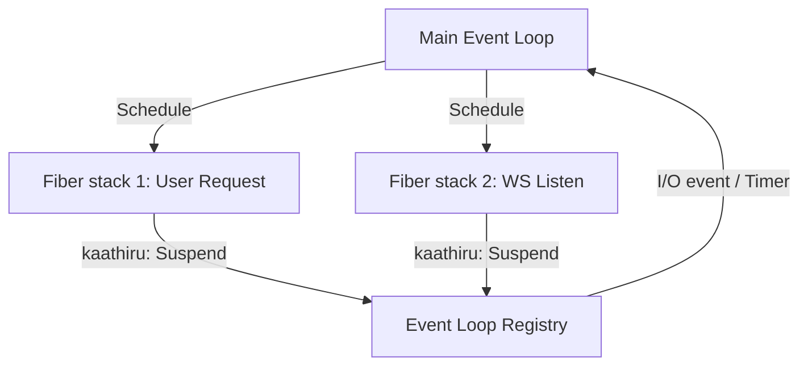

# THALAPATHY Staged Async/Await (varum / kaathiru) Fiber Design 🚀🔥

> [!NOTE]
> This document details the staged design for the native coroutine engine. It ensures a non-blocking execution model without thread-per-suspension resource leaks.

---

## 1. Syntax & Keywords

THALAPATHY async/await follows the movie dialogue identity of **"will come" (`varum`)** and **"wait" (`kaathiru`)**.

```tvk
// An async function returning a task
varum mersal punch() -> string {
    sollu("Aarambam... wait a minute.");
    makkal result = kaathiru delay_call(1000);
    thiruppi result + " — once I commit, I never look back!";
}

// An async anonymous function (lambda)
nanba f = varum kutty (n) {
    thiruppi kaathiru resolve_after(n);
};
```

---

## 2. The Fiber & Continuation Model

To implement `kaathiru` (await) without blocking the physical OS execution thread, the interpreter/VM requires cooperative multitasking. We select **Stackful Coroutines (Fibers)** over compiler-transformed state machines (CPS) to maintain a simple tree-walking interpreter structure and clean dynamic debugging.



### Fiber Context Structure

Each cooperative task is represented by a `Pani` (Task) class instance, containing:
1. **Fiber ID**: Unique identifier.
2. **Execution Stack**: Nested Call Frame activation records.
3. **Task Status**: `PENDING`, `RUNNING`, `SUSPENDED`, `COMPLETED`, or `FAILED`.
4. **Suspension Point**: The awaited socket handle, timer descriptor, or child task.
5. **Continuation Function**: The instruction index/AST node to resume execution.

---

## 3. Cooperative Scheduler & Event Loop

The scheduler runs on a single main OS thread. It polls file descriptors and timers using non-blocking OS primitives (`select`, `poll`, or `epoll` / `IOCP`).

| Task State | Transition Event | Action |
|---|---|---|
| **Pending** | Scheduler picks it up | Allocate fiber stack, set status `RUNNING` |
| **Suspended** | `kaathiru` expression evaluated | Save execution context, register I/O handle to Event Loop, yield control |
| **Resumed** | File descriptor becomes readable/writable or timer expires | Mark state `PENDING`, place back into scheduler run queue |
| **Completed** | Function returns | Resolve the `Pani` task value, resume any parent tasks waiting on this task |

### Avoidance of "Fake Blocking"
Unlike simple wrapper libraries that run `std::thread::join()` or block the main thread during await (fake blocking), the THALAPATHY fiber runtime registers interest in the underlying event loop, freeing the thread to run other request handlers or static tasks.

---

## 4. Parser & Interpreter Staging

Currently, the front-end components are fully implemented:
1. **Lexer**: Recognizes `varum` and `kaathiru` keywords as first-class tokens.
2. **Parser**: Supports function/method modifiers, lambdas, and prefix unary `kaathiru` expressions.
3. **Resolver**: Resolves types and performs standard scope validation.
4. **Bytecode IR**: Supports `OpCode::AWAIT`.
5. **Diagnostics**: Raises a clean compile/interpretation exception (`error[THALA-ASYNC-001]`) warning developers that the coroutine runtime is required for async execution.
